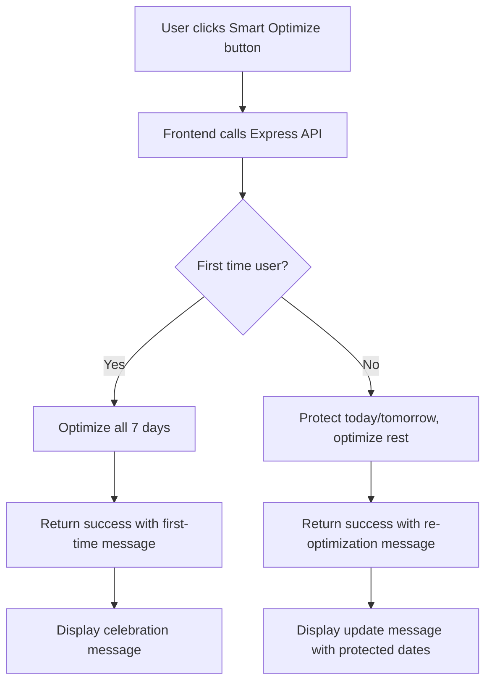

# 🧠 Smart One-Button Optimization System - Complete Implementation

## 🎯 Overview

Your smart one-button optimization system is now fully implemented! This intelligent system automatically handles both first-time and returning users with different optimization strategies and user-friendly messaging.

## 🏗️ Architecture

### Express Backend (`server/routes/schedule.js`)
- **Smart Optimization Route**: `POST /api/schedule/smart-optimize/:userId`
- **Intelligent Detection**: Automatically detects first-time vs returning users
- **Protected Dates**: For returning users, protects today/tomorrow and optimizes the rest
- **Smart Messaging**: Returns different success messages based on user scenario

### TypeScript Service (`frontend/services/windowCleaner.ts`)
- **Smart Method**: `smartOptimizeSchedule()` communicates with FastAPI `/smart-optimize/{userId}`
- **Error Handling**: Comprehensive error handling with user-friendly messages
- **Type Safety**: Full TypeScript integration with exported interfaces

### Frontend Utilities (`frontend/utils/smartOptimization.ts`)
- **Simple Function**: `smartOptimize()` - one-line call for optimization
- **Button Handler**: `handleSmartOptimizeClick()` - ready-to-use button handler
- **Message Formatting**: `formatOptimizationMessage()` - UI-ready messages

### React Component (`frontend/components/SmartOptimizeButton.tsx`)
- **Drop-in Component**: Ready-to-use React button component
- **Loading States**: Automatic loading indicators and animations
- **Result Display**: Beautiful success/error message display
- **Responsive Design**: Mobile-friendly with CSS animations

## 🔧 How It Works

### 1. User Flow


### 2. Technical Flow
```
Frontend Component → smartOptimize() → Express Route → FastAPI → Database
                                    ↓
     Beautiful UI ← Message Formatting ← Smart Response ← Optimization Results
```

## 🚀 Usage Examples

### Basic Usage (Simplest)
```jsx
import { SmartOptimizeButton } from './components/SmartOptimizeButton';

function MyPage() {
  return (
    <SmartOptimizeButton 
      userId="user123" 
      buttonText="🧠 Optimize My Schedule"
    />
  );
}
```

### Advanced Usage with Custom Handling
```jsx
import { handleSmartOptimizeClick } from './utils/smartOptimization';

function CustomButton({ userId }) {
  const [loading, setLoading] = useState(false);
  const [result, setResult] = useState(null);

  const handleClick = async () => {
    const result = await handleSmartOptimizeClick(userId, setLoading);
    setResult(result);
    
    if (result.success) {
      // Custom success handling
      console.log('Optimization successful!', result.data);
    }
  };

  return (
    <button onClick={handleClick} disabled={loading}>
      {loading ? 'Optimizing...' : 'Smart Optimize'}
    </button>
  );
}
```

### Direct Service Usage
```typescript
import windowCleanerService from './services/windowCleaner';

async function optimizeSchedule(userId: string) {
  try {
    const result = await windowCleanerService.smartOptimizeSchedule(
      userId,
      { monday_hours: 8, tuesday_hours: 8, /* ... */ }
    );
    
    if (result.isFirstTime) {
      console.log('🎉 First optimization!');
    } else {
      console.log('🔄 Re-optimization with protected dates:', result.protectedDates);
    }
  } catch (error) {
    console.error('Optimization failed:', error.message);
  }
}
```

## 🎨 UI Messages

### First-Time User
```
🎉 Welcome! Your schedule has been optimized for the first time!

📈 25 customers scheduled across 5 days
💰 Total weekly revenue: £1,250

✨ Your optimized route minimizes travel time and maximizes efficiency!
```

### Returning User
```
🔄 Schedule re-optimized successfully!

🛡️  Protected dates: 2024-01-15, 2024-01-16
📈 18 customers optimized
💰 Total weekly revenue: £950

✨ Your route has been updated while protecting your current commitments!
```

## 🔗 API Integration

### Express Route Endpoint
```javascript
POST /api/schedule/smart-optimize/:userId
```

**Request Body:**
```json
{
  "work_schedule": {
    "monday_hours": 8,
    "tuesday_hours": 8,
    "wednesday_hours": 8,
    "thursday_hours": 8,
    "friday_hours": 8,
    "saturday_hours": null,
    "sunday_hours": null
  },
  "cleaner_start_location": {
    "lat": 51.5074,
    "lng": -0.1278
  }
}
```

**Response:**
```json
{
  "success": true,
  "message": "🎉 First-time optimization completed! 25 customers scheduled across 5 days.",
  "data": {
    "isFirstTime": true,
    "summary": {
      "total_customers_scheduled": 25,
      "total_revenue": 1250,
      "working_days": 5
    },
    "schedule": { /* optimized schedule data */ }
  }
}
```

## ⚡ Features

### ✅ Implemented
- [x] **Smart Detection**: Automatic first-time vs returning user detection
- [x] **Protected Dates**: Returning users get today/tomorrow protected
- [x] **Intelligent Messaging**: Different messages for different scenarios
- [x] **Error Handling**: Comprehensive error handling with user-friendly messages
- [x] **Loading States**: Beautiful loading indicators and animations
- [x] **Type Safety**: Full TypeScript integration
- [x] **React Component**: Drop-in component ready to use
- [x] **Responsive Design**: Mobile-friendly with CSS animations
- [x] **Express Integration**: Complete backend API integration

### 🎯 Key Benefits
- **One Button**: Single button handles all scenarios automatically
- **User-Friendly**: Clear, helpful messages for every situation
- **Intelligent**: Automatically adapts behavior based on user history
- **Robust**: Comprehensive error handling for all edge cases
- **Beautiful**: Polished UI with animations and responsive design
- **Type-Safe**: Full TypeScript integration prevents runtime errors

## 🔧 Configuration

### Work Schedule Default
```typescript
{
  monday_hours: 8,      // 8 hours on Monday
  tuesday_hours: 8,     // 8 hours on Tuesday  
  wednesday_hours: 8,   // 8 hours on Wednesday
  thursday_hours: 8,    // 8 hours on Thursday
  friday_hours: 8,      // 8 hours on Friday
  saturday_hours: null, // No work on Saturday
  sunday_hours: null    // No work on Sunday
}
```

### Cleaner Location Default
```typescript
{
  lat: 51.5074,  // London latitude
  lng: -0.1278   // London longitude
}
```

## 🚨 Error Handling

The system handles these error scenarios gracefully:

- **No Customers**: "😔 No customers found for your account. Please add some customers before optimizing."
- **Network Issues**: "🌐 Connection problem. Please check your internet connection and try again."
- **Service Errors**: "⚙️ Optimization service error. Please try again in a moment."
- **Unexpected Errors**: "❌ Unexpected error occurred. [Error details]"

## 🎉 Ready to Use!

Your smart one-button optimization system is complete and ready to use! The system provides:

1. **Express backend route** with smart detection
2. **TypeScript service** with type safety
3. **Frontend utilities** for easy integration
4. **React component** ready to drop in
5. **CSS styles** for beautiful UI
6. **Comprehensive error handling**
7. **User-friendly messages**

Just import the `SmartOptimizeButton` component and pass a `userId` - everything else is handled automatically! 🚀